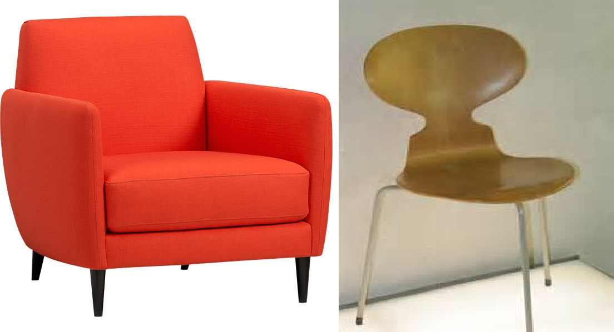

## Goals

-   Define "class"
-   Recognize what problems classes can solve
-   Show how R uses classes
-   Create a custom class

## Classy?

Classes are like Plato's "Forms"

Two objects of the same class:

  - Represent different *instances*
  - Share some qualities or functionality

```{r chairs, out.width="80%", echo=FALSE, fig.cap="Plush or wood, they're both \"chairy\""}

```

## Definitions

Class

:   Definition of structure (attributes) and behavior (methods) for similar
    objects

Instance

:   Object which is based on a class

*Class* is to *instance* as *blueprint* is to *building*

## Benefits

-   Group related objects into a single object
-   Just need to know common structure, not individual objects'
-   Methods isolate complex stuff
-   Defining an interface gives you flexibility to make changes

All of these are 100 times better for others using your code

## Example: sparse matrix

Often, programs require huge matrices where most of the values are `0`. To avoid
wasting memory and processing power, use the `Matrix` package.

```{r matrixExample}
library(Matrix)

m <- Matrix(c(0, 1, 0, 0), nrow = 2, ncol = 2, sparse = TRUE)
m
str(m)
```

## Classes in R

Everything is a classed object

```{r everythingClassed}
class(mtcars)
class(lapply)
```

## Stuctural inspection

To print a nice summary of an object's structure...

```{r structure}
str(faithful)
```

To get a `list` of an object's attributes...

```{r attributes}
attributes(AirPassengers)
```

## Methods

A generic function determines which method will handle the input

```{r genericBody}
summary
```

Methods are just functions with names like `generic.class`.

 Generic             | Class               | Method
:--------------------+:--------------------+:--------------------
`summary`            | `data.frame`        | `summary.data.frame`
`print`              | `table`             | `print.table`

If no classes for an object have a method, then the default (literally
`generic.default`) is used.

## Let's make a class

Using the S3 system, we'll make an `incidence` class that

1.  Stores data about disease incidence: diagnosis date and coordinates
2.  Gives an informative message when passed to `summary()`
3.  Draws a map of cases when passed to `plot()`

## The `incidence` class

To give an object an S3 class, just need to edit its `class` attribute

```{r s3Simple, eval=FALSE}
class(x) <- "incidence"
```

But that doesn't solve any of our structural problems, so it's better to provide
a function to handle structure

```{r s3Builder}
# Good to name the function after the class
incidence <- function(date, lat, long) {
  result <- data.frame(
    date = as.Date(date),
    lat  = as.numeric(lat),
    long = as.numeric(long)
  )
  # Add the new class, but also keep the old
  class(result) <- c("incidence", class(result))
  result
}
```

## Example data

```{r exampleData, message=FALSE}
library(lubridate)

study_start    <- ymd_hms("2016-01-01 00:00:00")
study_end      <- study_start + years(2)
set.seed(007)
reports <- data.frame(
  dx_time   = runif(100, study_start, study_end),
  longitude = runif(100, -81, -75),
  latitude  = runif(100,  40,  42)
)
reports$dx_time <- as_datetime(reports$dx_time)
head(reports)
```

## Applying the class

```{r classApply}
reports_inc <- incidence(
  date = reports$dx_time,
  lat  = reports$latitude,
  long = reports$longitude
)
str(reports_inc)
```

## Custom summary

Make sure to accept the same arguments as the generic function

```{r s3summary}
summary.incidence <- function(object, ...) {
  date_range <- range(object[["date"]])
  date_range <- as.character(date_range)
  msg <- sprintf(
    "%d cases diagnosed between %s and %s",
    nrow(object),
    date_range[1],
    date_range[2]
  )
  cat(msg)
}

```

```{r summaryUsing}
summary(reports_inc)
```

## Custom plot

```{r plotter}
library(maps)

plot.incidence <- function(x, ...) {
  maps::map("state", "pennsylvania")
  points(x[["long"]], x[["lat"]], ...)
}
```

```{r plotUsing, fig.height=5}
plot(reports_inc, pch = 4, col = "red")
```

## Helping hand for future users

Useful things to provide with a class:

### Documentation

If nobody knows how to use a class, it might as well not exist

### Validation

Have the builder function raise errors for unexpected input

### Coercion

If it makes sense, provide a function named `as.myclass()`
